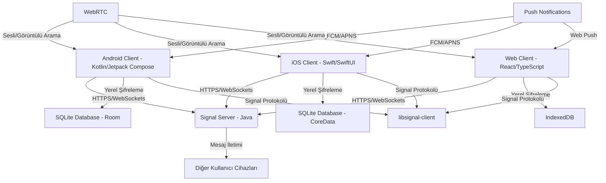
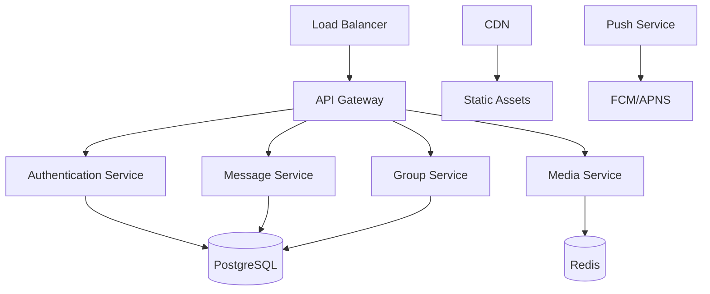

# PrivacyMessage Teknik Mimari Dokümantasyonu

## Sistem Genel Bakış

PrivacyMessage, Signal protokolünü temel alan çok platformlu bir mesajlaşma uygulamasıdır. Sistem, uçtan uca şifreleme (E2EE) ile maksimum gizlilik sağlarken, modern kullanıcı deneyimi sunar.

## Mimari Diyagramı



## Bileşen Detayları

### 1. İstemci Katmanı (Client Layer)

#### Android Uygulaması
- **Teknoloji:** Kotlin 1.8+, Jetpack Compose, Android API 24+
- **Ana Kütüphaneler:**
  - `libsignal-client`: Signal protokolü implementasyonu
  - `Room`: Yerel veritabanı
  - `Retrofit`: Ağ istekleri
  - `Hilt`: Dependency injection
  - `Coroutines`: Asenkron işlemler
- **Mimari Pattern:** MVVM (Model-View-ViewModel)
- **Minimum SDK:** API 24 (Android 7.0)

#### iOS Uygulaması
- **Teknoloji:** Swift 5.8+, SwiftUI, iOS 14+
- **Ana Kütüphaneler:**
  - `libsignal-client`: Signal protokolü implementasyonu
  - `CoreData`: Yerel veritabanı
  - `Combine`: Reactive programming
  - `URLSession`: Ağ istekleri
- **Mimari Pattern:** MVVM + Combine
- **Minimum iOS:** 14.0

#### Web Uygulaması
- **Teknoloji:** React 18+, TypeScript 5.0+, Node.js 18+
- **Ana Kütüphaneler:**
  - `libsignal-client`: Signal protokolü implementasyonu
  - `IndexedDB`: Yerel veritabanı
  - `WebRTC`: Sesli/görüntülü arama
  - `React Query`: Server state management
- **Mimari Pattern:** Component-based + React Hooks
- **Tarayıcı Desteği:** Chrome 90+, Firefox 88+, Safari 14+

### 2. Sunucu Katmanı (Server Layer)

#### Signal Server
- **Teknoloji:** Java 17+, Spring Boot 3.0+
- **Veritabanı:** PostgreSQL 14+
- **Cache:** Redis 7.0+
- **Message Queue:** RabbitMQ 3.9+
- **Container:** Docker + Kubernetes

#### Sunucu Bileşenleri
1. **Authentication Service**
   - SMS doğrulama
   - JWT token yönetimi
   - Rate limiting

2. **Message Service**
   - Mesaj yönlendirme
   - Offline mesaj depolama
   - Push notification gönderimi

3. **Group Service**
   - Grup yönetimi
   - Üye işlemleri
   - Grup şifreleme anahtarları

4. **Media Service**
   - Dosya upload/download
   - CDN entegrasyonu
   - Medya şifreleme

### 3. Veri Katmanı (Data Layer)

#### Yerel Veritabanı Şeması

```sql
-- Kullanıcılar
CREATE TABLE users (
    id INTEGER PRIMARY KEY,
    phone_number TEXT UNIQUE NOT NULL,
    uuid TEXT UNIQUE NOT NULL,
    profile_key BLOB,
    created_at TIMESTAMP DEFAULT CURRENT_TIMESTAMP
);

-- Sohbetler
CREATE TABLE conversations (
    id INTEGER PRIMARY KEY,
    recipient_id INTEGER,
    group_id INTEGER,
    last_message_id INTEGER,
    unread_count INTEGER DEFAULT 0,
    created_at TIMESTAMP DEFAULT CURRENT_TIMESTAMP
);

-- Mesajlar
CREATE TABLE messages (
    id INTEGER PRIMARY KEY,
    conversation_id INTEGER,
    sender_id INTEGER,
    content TEXT,
    encrypted_content BLOB,
    message_type TEXT,
    timestamp TIMESTAMP,
    is_read BOOLEAN DEFAULT FALSE,
    FOREIGN KEY (conversation_id) REFERENCES conversations(id)
);

-- Şifreleme Anahtarları
CREATE TABLE encryption_keys (
    id INTEGER PRIMARY KEY,
    user_id INTEGER,
    key_type TEXT,
    public_key BLOB,
    private_key BLOB,
    created_at TIMESTAMP DEFAULT CURRENT_TIMESTAMP
);
```

#### Sunucu Veritabanı Şeması

```sql
-- Minimum veri toplama ilkesi
CREATE TABLE users (
    id SERIAL PRIMARY KEY,
    phone_number VARCHAR(20) UNIQUE NOT NULL,
    uuid UUID UNIQUE NOT NULL,
    device_id VARCHAR(64),
    last_seen TIMESTAMP,
    created_at TIMESTAMP DEFAULT CURRENT_TIMESTAMP
);

-- Mesaj yönlendirme için gerekli minimum veri
CREATE TABLE message_queue (
    id SERIAL PRIMARY KEY,
    recipient_uuid UUID NOT NULL,
    sender_uuid UUID NOT NULL,
    encrypted_payload BYTEA,
    timestamp TIMESTAMP DEFAULT CURRENT_TIMESTAMP
);
```

### 4. Güvenlik Katmanı (Security Layer)

#### Şifreleme Protokolü
1. **X3DH Key Agreement**
   - İlk oturum kurulumu
   - Ephemeral anahtar değişimi
   - Perfect forward secrecy

2. **Double Ratchet Algorithm**
   - Mesaj şifreleme
   - Anahtar yenileme
   - Replay attack koruması

3. **PQXDH (Post-Quantum)**
   - Kuantum bilgisayar koruması
   - Hybrid şifreleme
   - Future-proof güvenlik

#### Güvenlik Özellikleri
- **Safety Number Verification:** QR kod ile güvenlik doğrulama
- **Registration Lock:** PIN tabanlı hesap koruması
- **Sealed Sender:** Gönderen gizliliği
- **Disappearing Messages:** Zamanlı mesaj silme
- **Screen Security:** Screenshot koruması

### 5. Ağ Katmanı (Network Layer)

#### Protokoller
- **HTTPS:** Tüm API istekleri
- **WebSocket:** Gerçek zamanlı mesajlaşma
- **WebRTC:** Sesli/görüntülü arama
- **Signal Protocol:** Mesaj şifreleme

#### API Endpoints

```typescript
// Authentication
POST /api/v1/auth/register
POST /api/v1/auth/verify
POST /api/v1/auth/login

// Messages
POST /api/v1/messages/send
GET /api/v1/messages/receive
DELETE /api/v1/messages/{id}

// Groups
POST /api/v1/groups/create
PUT /api/v1/groups/{id}/members
GET /api/v1/groups/{id}/info

// Media
POST /api/v1/media/upload
GET /api/v1/media/{id}/download
DELETE /api/v1/media/{id}
```

### 6. Performans Optimizasyonları

#### İstemci Tarafı
- **Lazy Loading:** Mesaj geçmişi
- **Image Caching:** Glide/Kingfisher
- **Background Processing:** WorkManager/BackgroundTasks
- **Memory Management:** Weak references, object pooling

#### Sunucu Tarafı
- **Load Balancing:** Nginx + HAProxy
- **Caching:** Redis cluster
- **Database Optimization:** Connection pooling, indexing
- **CDN:** Static asset delivery

### 7. Monitoring ve Logging

#### Metrikler
- **Performance:** Response time, throughput
- **Security:** Failed authentication attempts
- **User Experience:** App crashes, error rates
- **Infrastructure:** CPU, memory, disk usage

#### Logging
- **Structured Logging:** JSON format
- **Log Levels:** ERROR, WARN, INFO, DEBUG
- **Privacy:** PII filtering, data anonymization
- **Retention:** 30 days for operational logs

## Deployment Mimarisi



## Güvenlik Kontrol Listesi

- [ ] Tüm API istekleri HTTPS üzerinden
- [ ] JWT token expiration kontrolü
- [ ] Rate limiting uygulanması
- [ ] Input validation ve sanitization
- [ ] SQL injection koruması
- [ ] XSS koruması
- [ ] CSRF token kullanımı
- [ ] Secure headers (HSTS, CSP)
- [ ] Regular security audits
- [ ] Dependency vulnerability scanning