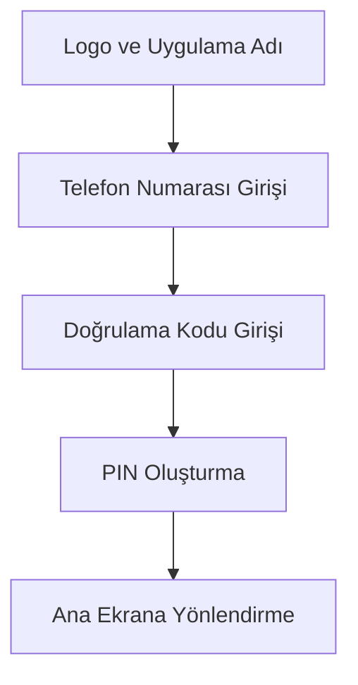
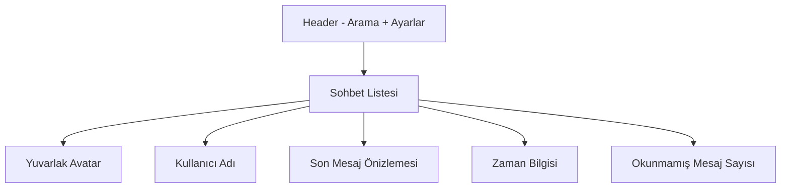
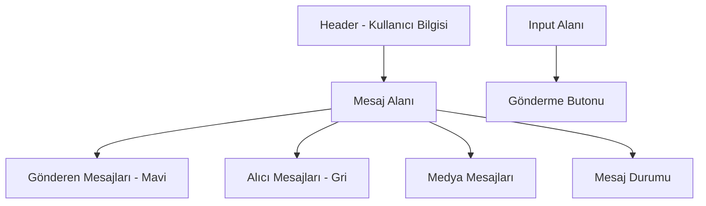
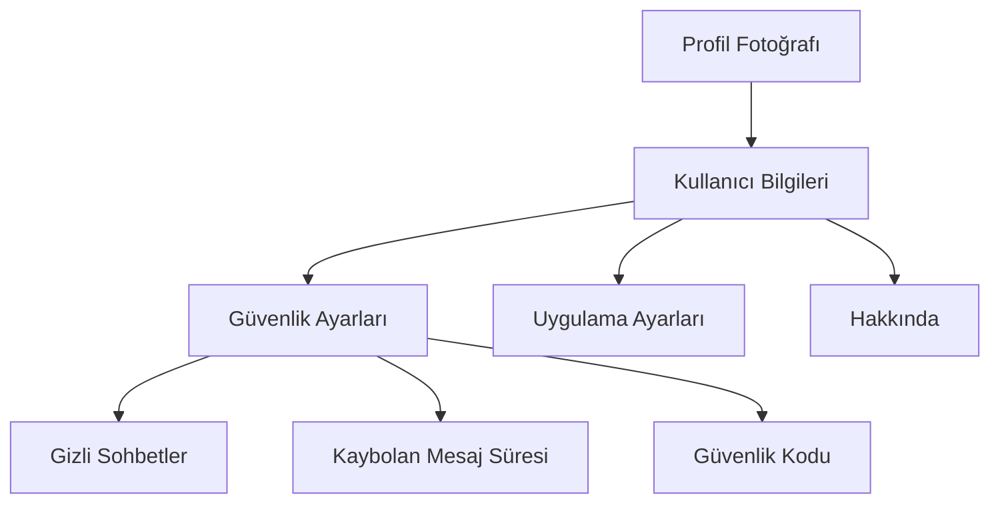

# PrivacyMessage UI/UX Tasarım Dokümantasyonu

## Tasarım Felsefesi

PrivacyMessage, güvenlik ve gizliliği ön planda tutan, modern ve minimalist bir tasarım yaklaşımı benimser. Kullanıcı deneyimi, karmaşık güvenlik işlemlerini arka planda tutarak, sezgisel ve akıcı bir arayüz sunar.

## Renk Paleti

### Ana Renkler
```css
/* Ana Renk - Güvenliği Temsil Eder */
--primary-blue: #2563EB;
--primary-blue-light: #3B82F6;
--primary-blue-dark: #1D4ED8;

/* Aksan Renk - Önemli Aksiyonlar İçin */
--accent-orange: #F97316;
--accent-orange-light: #FB923C;
--accent-orange-dark: #EA580C;

/* Nötr Renkler */
--neutral-white: #FFFFFF;
--neutral-gray-50: #F9FAFB;
--neutral-gray-100: #F3F4F6;
--neutral-gray-200: #E5E7EB;
--neutral-gray-300: #D1D5DB;
--neutral-gray-400: #9CA3AF;
--neutral-gray-500: #6B7280;
--neutral-gray-600: #4B5563;
--neutral-gray-700: #374151;
--neutral-gray-800: #1F2937;
--neutral-gray-900: #111827;
```

### Koyu Mod Renkleri
```css
/* Koyu Mod */
--dark-bg-primary: #1E293B;
--dark-bg-secondary: #334155;
--dark-bg-tertiary: #475569;
--dark-text-primary: #F1F5F9;
--dark-text-secondary: #CBD5E1;
--dark-border: #475569;
```

### Durum Renkleri
```css
/* Başarı */
--success-green: #10B981;
--success-green-light: #34D399;

/* Hata */
--error-red: #EF4444;
--error-red-light: #F87171;

/* Uyarı */
--warning-yellow: #F59E0B;
--warning-yellow-light: #FBBF24;

/* Bilgi */
--info-blue: #3B82F6;
--info-blue-light: #60A5FA;
```

## Tipografi

### Font Ailesi
```css
/* Ana Font */
--font-family-primary: 'Inter', -apple-system, BlinkMacSystemFont, 'Segoe UI', Roboto, sans-serif;

/* Monospace Font (Kodlar için) */
--font-family-mono: 'JetBrains Mono', 'Fira Code', 'Consolas', monospace;
```

### Font Boyutları
```css
/* Başlıklar */
--text-xs: 0.75rem;    /* 12px */
--text-sm: 0.875rem;   /* 14px */
--text-base: 1rem;     /* 16px */
--text-lg: 1.125rem;   /* 18px */
--text-xl: 1.25rem;    /* 20px */
--text-2xl: 1.5rem;    /* 24px */
--text-3xl: 1.875rem;  /* 30px */
--text-4xl: 2.25rem;   /* 36px */
```

### Font Ağırlıkları
```css
--font-light: 300;
--font-normal: 400;
--font-medium: 500;
--font-semibold: 600;
--font-bold: 700;
```

## Bileşen Tasarımı

### Butonlar

#### Primary Button
```css
.primary-button {
  background-color: var(--primary-blue);
  color: var(--neutral-white);
  padding: 12px 24px;
  border-radius: 8px;
  font-weight: var(--font-medium);
  border: none;
  cursor: pointer;
  transition: all 0.2s ease;
}

.primary-button:hover {
  background-color: var(--primary-blue-dark);
  transform: translateY(-1px);
  box-shadow: 0 4px 12px rgba(37, 99, 235, 0.3);
}
```

#### Secondary Button
```css
.secondary-button {
  background-color: transparent;
  color: var(--primary-blue);
  padding: 12px 24px;
  border-radius: 8px;
  font-weight: var(--font-medium);
  border: 2px solid var(--primary-blue);
  cursor: pointer;
  transition: all 0.2s ease;
}

.secondary-button:hover {
  background-color: var(--primary-blue);
  color: var(--neutral-white);
}
```

#### Accent Button
```css
.accent-button {
  background-color: var(--accent-orange);
  color: var(--neutral-white);
  padding: 12px 24px;
  border-radius: 8px;
  font-weight: var(--font-medium);
  border: none;
  cursor: pointer;
  transition: all 0.2s ease;
}

.accent-button:hover {
  background-color: var(--accent-orange-dark);
  transform: translateY(-1px);
  box-shadow: 0 4px 12px rgba(249, 115, 22, 0.3);
}
```

### Input Alanları

#### Text Input
```css
.text-input {
  width: 100%;
  padding: 12px 16px;
  border: 2px solid var(--neutral-gray-300);
  border-radius: 8px;
  font-size: var(--text-base);
  transition: border-color 0.2s ease;
}

.text-input:focus {
  outline: none;
  border-color: var(--primary-blue);
  box-shadow: 0 0 0 3px rgba(37, 99, 235, 0.1);
}

.text-input.error {
  border-color: var(--error-red);
}
```

#### Search Input
```css
.search-input {
  width: 100%;
  padding: 12px 16px 12px 48px;
  border: 2px solid var(--neutral-gray-300);
  border-radius: 24px;
  font-size: var(--text-base);
  background-image: url('search-icon.svg');
  background-repeat: no-repeat;
  background-position: 16px center;
  transition: all 0.2s ease;
}

.search-input:focus {
  outline: none;
  border-color: var(--primary-blue);
  box-shadow: 0 0 0 3px rgba(37, 99, 235, 0.1);
}
```

### Kartlar

#### Message Card
```css
.message-card {
  background-color: var(--neutral-white);
  border-radius: 12px;
  padding: 16px;
  margin-bottom: 8px;
  box-shadow: 0 2px 8px rgba(0, 0, 0, 0.1);
  transition: all 0.2s ease;
}

.message-card:hover {
  box-shadow: 0 4px 16px rgba(0, 0, 0, 0.15);
  transform: translateY(-2px);
}

.message-card.sent {
  background-color: var(--primary-blue);
  color: var(--neutral-white);
}

.message-card.received {
  background-color: var(--neutral-gray-100);
  color: var(--neutral-gray-900);
}
```

#### Contact Card
```css
.contact-card {
  display: flex;
  align-items: center;
  padding: 12px 16px;
  border-radius: 8px;
  transition: background-color 0.2s ease;
  cursor: pointer;
}

.contact-card:hover {
  background-color: var(--neutral-gray-100);
}

.contact-avatar {
  width: 48px;
  height: 48px;
  border-radius: 50%;
  margin-right: 12px;
  background-color: var(--primary-blue);
  display: flex;
  align-items: center;
  justify-content: center;
  color: var(--neutral-white);
  font-weight: var(--font-semibold);
}
```

## Ekran Tasarımları

### 1. Hoş Geldiniz/Kayıt Ekranı



**Tasarım Özellikleri:**
- Minimalist tasarım, sadece gerekli alanlar
- Büyük, okunabilir input alanları
- Güvenlik vurgusu (kilit ikonu, güvenlik mesajları)
- Progress indicator (adım adım kayıt süreci)

### 2. Ana Sohbet Listesi



**Tasarım Özellikleri:**
- Floating Action Button (yeni sohbet)
- Swipe actions (silme, arşivleme)
- Online/offline durumu göstergesi
- Mesaj durumu ikonları (gönderildi, iletildi, okundu)

### 3. Sohbet Ekranı



**Tasarım Özellikleri:**
- Balon şeklinde mesaj tasarımı
- Medya önizleme (resim, video thumbnail)
- Yazıyor... indikatörü
- Mesaj zaman damgası
- Reply/forward seçenekleri

### 4. Profil/Ayarlar Ekranı



**Tasarım Özellikleri:**
- Kategorize edilmiş ayarlar
- Toggle switch'ler
- Slider'lar (zaman ayarları için)
- QR kod gösterimi
- Güvenlik seviyesi göstergesi

## Animasyonlar ve Geçişler

### Mesaj Animasyonları

#### Yeni Mesaj Gelişi
```css
@keyframes messageSlideIn {
  0% {
    opacity: 0;
    transform: translateY(20px);
  }
  100% {
    opacity: 1;
    transform: translateY(0);
  }
}

.new-message {
  animation: messageSlideIn 0.3s ease-out;
}
```

#### Yazıyor... Animasyonu
```css
@keyframes typing {
  0%, 60%, 100% {
    opacity: 0.4;
  }
  30% {
    opacity: 1;
  }
}

.typing-indicator {
  animation: typing 1.4s infinite;
}
```

### Sayfa Geçişleri

#### Slide Transition
```css
.page-transition {
  transition: transform 0.3s ease-in-out;
}

.page-enter {
  transform: translateX(100%);
}

.page-enter-active {
  transform: translateX(0);
}

.page-exit {
  transform: translateX(0);
}

.page-exit-active {
  transform: translateX(-100%);
}
```

### Loading Animasyonları

#### Spinner
```css
@keyframes spin {
  0% {
    transform: rotate(0deg);
  }
  100% {
    transform: rotate(360deg);
  }
}

.spinner {
  width: 24px;
  height: 24px;
  border: 3px solid var(--neutral-gray-300);
  border-top: 3px solid var(--primary-blue);
  border-radius: 50%;
  animation: spin 1s linear infinite;
}
```

## Responsive Tasarım

### Breakpoint'ler
```css
/* Mobile First Approach */
--breakpoint-sm: 640px;
--breakpoint-md: 768px;
--breakpoint-lg: 1024px;
--breakpoint-xl: 1280px;
--breakpoint-2xl: 1536px;
```

### Grid Sistemi
```css
.container {
  width: 100%;
  max-width: 1200px;
  margin: 0 auto;
  padding: 0 16px;
}

.grid {
  display: grid;
  gap: 16px;
}

/* Mobile */
.grid-cols-1 {
  grid-template-columns: 1fr;
}

/* Tablet */
@media (min-width: 768px) {
  .grid-cols-2 {
    grid-template-columns: repeat(2, 1fr);
  }
}

/* Desktop */
@media (min-width: 1024px) {
  .grid-cols-3 {
    grid-template-columns: repeat(3, 1fr);
  }
}
```

## Erişilebilirlik (Accessibility)

### Renk Kontrastı
- Minimum 4.5:1 kontrast oranı
- WCAG 2.1 AA standartlarına uygunluk
- Koyu mod desteği

### Klavye Navigasyonu
- Tab sırası mantıklı düzen
- Focus indicator'ları görünür
- Keyboard shortcut'ları

### Screen Reader Desteği
- Semantic HTML kullanımı
- ARIA label'ları
- Alt text'ler

### Touch Target Boyutları
- Minimum 44x44px dokunma alanı
- Yeterli spacing
- Gesture desteği

## Platform Özel Tasarımlar

### Android (Material Design 3)
- Material You renk sistemi
- Dynamic color desteği
- Ripple effect'ler
- Bottom navigation

### iOS (Human Interface Guidelines)
- SF Symbols kullanımı
- iOS native gesture'ları
- Tab bar tasarımı
- Haptic feedback

### Web (Progressive Web App)
- Service worker desteği
- Offline functionality
- Install prompt
- Push notification

## Performans Optimizasyonları

### Image Optimization
- WebP format desteği
- Lazy loading
- Progressive loading
- Responsive images

### Animation Performance
- CSS transform kullanımı
- Hardware acceleration
- Reduced motion desteği
- Frame rate optimization

### Code Splitting
- Route-based splitting
- Component lazy loading
- Bundle size optimization
- Tree shaking